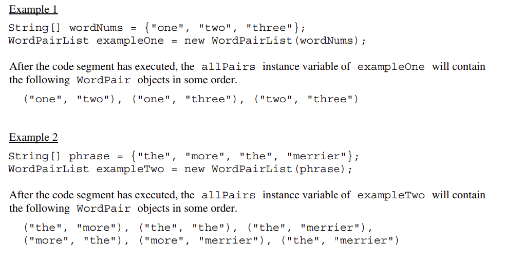

# WordPairsFRQ
Implementation of 2018 WordPairs FRQ
This challenge is based on the 2018 Free Response Question #2 WordPair. You are encouraged to work in pairs on this challenge.
[Link to FRQ text](https://secure-media.collegeboard.org/ap/pdf/ap18-frq-computer-science-a.pdf#page=7)

Create a new Java Project in Eclipse and add the java files here into the src folder.

In this FRQ, you are given an array of words and you will create pairs of them by taking the first word and pairing it with all the other words, then taking the second word and pairing it with all but the first one, and so on. For example, if the word array is [“Hi”, “there”, “Tyler”, “Sam”], this figure shows how the word pairs are formed.


In the class WordPairsList below, you will write the constructor which takes the array of words and pairs them up as shown in the figure. You will need nested loops to pair each element with the rest of the elements in the list. Here is the pseudocode.
```
*Initialize the allPairs list to an empty ArrayList of WordPair objects.

*Loop through the words array for the first word in the word pair (for loop from index i = 0 to length-1)

    *Loop through the rest of the word array starting from index i+1 for the second word in the word pair (for loop from index j = i+1 to length)

    *Add the new WordPair formed from the ith word and the jth word to the allPairs ArrayList.
```
In the next part of the FRQ challenge, you are asked to write a method called numMatches() that counts and returns the number of pairs where the first word is the same as the second word. For example, if the word array is [“hi”,”bye”,”hi”], the pairs generated would be [“hi”,”bye”], [“hi”,”hi”], and [“bye”,”hi”]. In the second pair [“hi”,”hi”], the first word is the same as the second word, so numMatches() would return 1.

For this method, you will need a loop that goes through the ArrayList allPairs and for each WordPair in allPairs, it checks to see if its first word (using the getFirst() method) equals the second word (using the getSecond() method). If there is a match, it increments a counter which it returns at the end of the method. To test this method, add another “there” into the words array and then uncomment the call to numMatches().
